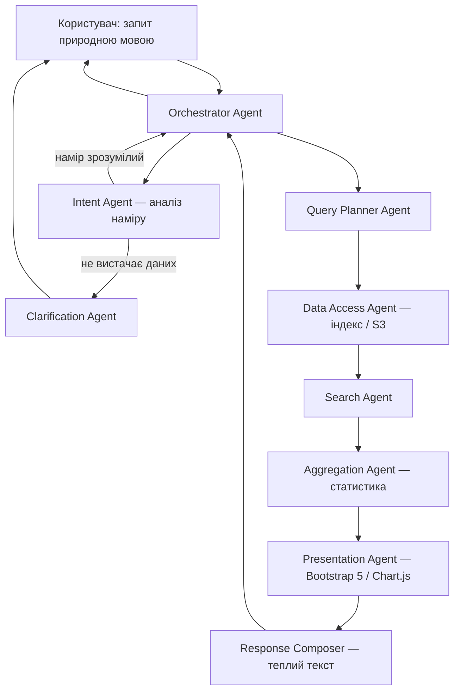

# Bevar Ukraine — Smart Email Archive


Внутрішній інструмент команди **Bevar Ukraine** для роботи з поштовим архівом організації. Система приймає запити природною мовою (українською, англійською, данською, російською), аналізує архів і повертає точні відповіді — з інтерактивними таблицями, графіками та статистикою. Відповіді написані теплим, людяним тоном від імені члена команди.

Побудована на багатоагентній архітектурі: оркестратор координує спеціалізованих агентів, кожен з яких відповідає за свою ділянку — від розбору наміру до рендерингу Bootstrap 5 таблиць.

---

## Зміст

- [Можливості](#можливості)
- [Архітектура](#архітектура)
- [Технологічний стек](#технологічний-стек)
- [Передумови](#передумови)
- [Швидкий старт](#швидкий-старт)
- [Конфігурація через `.env`](#конфігурація-через-env)
- [Ingestion / Індексація архіву](#ingestion--індексація-архіву)
- [Запуск через Docker](#запуск-через-docker)
- [Використання та приклади](#використання-та-приклади)
- [CI/CD](#cicd)
- [Тестування](#тестування)
- [Структура проєкту](#структура-проєкту)
- [Безпека та приватність](#безпека-та-приватність)
- [Внесок (Contributing)](#внесок-contributing)
- [Ліцензія](#ліцензія)
- [Команда](#команда)

---

## Можливості

| Можливість | Опис |
|---|---|
| Запити природною мовою | Задайте питання звичайною мовою — система знайде потрібне в архіві |
| Багатоагентна обробка | Оркестратор + 8 спеціалізованих агентів із чіткими зонами відповідальності |
| Аналіз наміру та уточнення | Якщо запит неоднозначний — система перепитає 1–3 конкретних питання |
| Пошук по всьому архіву | Жодних прихованих лімітів; часові рамки — тільки за явним запитом користувача |
| Таблиці Bootstrap 5 | Пагінація, пошук по колонках, сортування, фільтри — для будь-яких списків |
| Графіки та статистика | Динаміка листів, топ-відправники, розподіл за категоріями (Chart.js) |
| Теплі відповіді | Супровідний текст — людяний, професійний, від імені команди Bevar Ukraine |
| Експорт у CSV | Вивантаження поточної вибірки одним натисканням |
| Перегляд тредів | Відображення цілого ланцюжка листів за `References` / `In-Reply-To` |
| Аудит-лог | Усі запити логуються: хто, що шукав, коли, скільки результатів |

---

## Архітектура

Система побудована за принципом **single responsibility** — кожен агент робить одну справу і робить її добре. Обмін між агентами — через типізовані Pydantic v2 моделі.



### Агенти

| Агент | Зона відповідальності |
|---|---|
| **Orchestrator** | Маршрутизація, координація, стан сесії, політика безпеки «тільки архів» |
| **Intent Agent** | Розбір наміру: тип запиту, параметри, оцінка достатності даних |
| **Clarification Agent** | Формулювання теплих уточнюючих питань (1–3, не допит) |
| **Query Planner** | Перетворення `QueryIntent` → виконуваний `QueryPlan` для індексу |
| **Data Access Agent** | Єдина точка доступу до DuckDB-індексу та S3 |
| **Search Agent** | Виконання плану, ранжування, збір тредів |
| **Aggregation Agent** | Підрахунки, топи, динаміка у часі, розподіли |
| **Presentation Agent** | Рендеринг таблиць Bootstrap 5, конфігурації Chart.js |
| **Response Composer** | Теплий супровідний текст на мові користувача, без вигаданих фактів |

---

## Технологічний стек

| Категорія | Інструмент |
|---|---|
| Мова | Python 3.10+ (повна типізація) |
| Моделі даних | Pydantic v2 |
| Backend API | FastAPI (async, OpenAPI) |
| S3 | boto3 (streaming, exponential backoff) |
| Індекс / сховище | DuckDB (FTS extension, BM25, аналітика) |
| LLM | Claude через AWS Bedrock (`AnthropicBedrock` SDK) |
| Фронтенд | Jinja2 + Bootstrap 5 + Chart.js |
| Парсинг пошти | stdlib `mailbox` + `email`, `charset-normalizer` |
| Тести | pytest, pytest-cov, pytest-asyncio |
| Лінтер / формат | ruff |
| Типізація | mypy |
| Логування | structlog (JSON у продакшні) |
| Контейнеризація | Docker, docker-compose |
| CI/CD | GitHub Actions |

---

## Передумови

- **Python 3.10+** (рекомендовано 3.11+)
- **Docker** (опціонально, для контейнерного запуску)
- **Доступ до AWS S3**:
  - Bucket: `bevar-ukraine-emails-archive-andriy-kuzmyn`
  - Об'єкт: `bevar-ukraine-mails.mbox`
  - Регіон: `us-east-1`
  - Мінімальні права: `s3:GetObject`, `s3:HeadObject` на цей bucket/prefix
- **Доступ до AWS Bedrock** — IAM-права `bedrock:InvokeModel` на потрібні моделі (без Bedrock працюють rule-based фолбеки)

---

## Швидкий старт

```bash
# 1. Клонуйте репозиторій
git clone https://github.com/bevar-ukraine/bevar-ukraine-smart-email-handler-AK.git
cd bevar-ukraine-smart-email-handler-AK

# 2. Створіть віртуальне оточення та встановіть залежності
python3 -m venv .venv
source .venv/bin/activate
pip install -e ".[dev]"

# 3. Скопіюйте шаблон конфігурації та заповніть значення
cp .env .env
# Відредагуйте .env — вкажіть AWS credentials (для S3 та Bedrock)

# 4. Запустіть первинну ингестію архіву з S3
python3 main.py ingest

# 5. Запустіть сервер
python3 main.py

# 6. Відкрийте у браузері
# http://localhost:8000
```

Якщо у вас є локальний `.mbox` файл для тестування:

```bash
python3 main.py ingest-local path/to/your/file.mbox
```

---

## Конфігурація через `.env`

> `.env` **обов'язково** у `.gitignore` — він ніколи не комітиться. У репозиторії лежить **`.env.example`** як шаблон і документація.

| Змінна | Опис | Приклад / за замовчуванням | Обов'язкова |
|---|---|---|---|
| `AWS_REGION` | Регіон AWS (S3 + Bedrock) | `us-east-1` | Ні (є default) |
| `AWS_ACCESS_KEY_ID` | Ключ доступу AWS (або IAM Role на проді) | — | Для локальної розробки |
| `AWS_SECRET_ACCESS_KEY` | Секретний ключ AWS | — | Для локальної розробки |
| `S3_BUCKET_NAME` | Назва S3-бакету | `bevar-ukraine-emails-archive-andriy-kuzmyn` | Ні (є default) |
| `S3_OBJECT_KEY` | Шлях до mbox-об'єкта | `bevar-ukraine-mails.mbox` | Ні (є default) |
| `BEDROCK_MODEL_ID` | ID моделі Claude у Bedrock | `us.anthropic.claude-sonnet-4-6` | Ні (є default) |
| `DUCKDB_PATH` | Шлях до файлу DuckDB-індексу | `data/emails.duckdb` | Ні (є default) |
| `APP_ENV` | Оточення: `development` / `production` | `development` | Ні |
| `APP_HOST` | Хост сервера | `0.0.0.0` | Ні |
| `APP_PORT` | Порт сервера | `8000` | Ні |
| `LOG_LEVEL` | Рівень логування | `INFO` | Ні |
| `SECRET_KEY` | Секрет для сесій | — | На проді |
| `ALLOWED_ORIGINS` | CORS origins (через кому) | `http://localhost:8000` | Ні |

На продакшні рекомендується **IAM Role** для AWS (без довгоживучих ключів). `.env` — для локальної розробки.

---

## Ingestion / Індексація архіву

Система **не парсить mbox на кожен запит**. Замість цього існує окремий етап ингестії, який:

1. Стримить `bevar-ukraine-mails.mbox` з S3 (або з локального файлу)
2. Парсить повідомлення по одному (потоково, не тримаючи весь файл у пам'яті)
3. Витягує й нормалізує метадані: дата (UTC), відправник, отримувачі, тема, тіло, вкладення, треди
4. Зберігає у DuckDB-індекс із FTS (повнотекстовий пошук)
5. Записує **маніфест ингестії** (ETag, offset, кількість листів) для інкрементального оновлення

### Ключові властивості

- **Ідемпотентність** — повторний запуск не дублює дані
- **Відновлюваність** — продовження з місця зупинки при збоях
- **Стійкість** — битий лист не зупиняє процес (логується як `parse_error`)
- **Інкрементальність** — mbox append-only, тому дочитуємо лише хвіст

```bash
# Первинна ингестія з S3
python3 main.py ingest

# Примусова реіндексація
python3 main.py ingest --force

# Ингестія з локального файлу
python3 main.py ingest-local /path/to/mails.mbox
```

Статус ингестії доступний через API: `GET /api/ingestion/status`

---

## Запуск через Docker

```bash
# Збірка образу
docker build -t bevar-email-handler .

# Запуск з .env файлом
docker run -p 8000:8000 --env-file .env bevar-email-handler

# Або через docker-compose
docker compose up -d
```

Docker-образ включає health check (`/api/health`) з інтервалом 30 секунд.

---

## Використання та приклади

Відкрийте `http://localhost:8000` і введіть запит у пошукове поле. Ось приклади того, що можна запитати:

| Запит | Що поверне система |
|---|---|
| «Покажи всі листи від GlobalGiving за 2024 рік» | Таблиця Bootstrap 5 з пагінацією, сортуванням і фільтрами |
| «Скільки листів ми отримали по місяцях?» | Line-chart динаміки + супровідний текст |
| «Хто найчастіше нам писав?» | Bar-chart топ-відправників + таблиця з кількостями |
| «Знайди листи з вкладеннями про partnership» | Таблиця з колонкою вкладень, відфільтрована за ключовим словом |
| «Листи» (занадто широкий запит) | Система перепитає: «Уточніть, будь ласка: вас цікавить переписка з конкретною людиною, або всі листи за певний період?» |
| «Покажи тред з msg001@bevar.org» | Ланцюжок повідомлень у модальному вікні |

### Як виглядає результат

**Таблиця Bootstrap 5:**


*Колонки: Дата, Від, Кому, Тема, Вкладення, Розмір, Дії. Пагінація, сортування, пошук.*

**Графік (Chart.js):**


*Динаміка листів за місяцями, топ-відправники, розподіл за категоріями.*

### API-ендпоінти

| Метод | Шлях | Опис |
|---|---|---|
| `POST` | `/api/query` | Запит природною мовою |
| `GET` | `/api/email/{message_id}` | Повний лист за ID |
| `GET` | `/api/thread/{thread_id}` | Усі листи в треді |
| `GET` | `/api/stats` | Загальна статистика архіву |
| `GET` | `/api/top-senders?limit=20` | Топ відправників |
| `GET` | `/api/timeline` | Динаміка листів у часі |
| `GET` | `/api/export/csv?q=...` | Експорт вибірки у CSV |
| `GET` | `/api/health` | Health check |
| `GET` | `/api/ingestion/status` | Статус ингестії |
| `POST` | `/api/ingestion/trigger` | Запустити ингестію |

---

## CI/CD

Пайплайн налаштовано у `.github/workflows/ci.yml` на гілку `main`.

| Етап | Що робить | Коли запускається |
|---|---|---|
| **Lint** | `ruff check` + `ruff format --check` | Push / PR у `main` |
| **Type check** | `mypy` | Push / PR у `main` |
| **Tests** | `pytest` з покриттям | Push / PR у `main` |
| **Docker build** | Збірка та перевірка образу | Push / PR у `main` |
| **Deploy** | Збірка образу з тегами `latest` + git SHA | Merge у `main` |

### Правила

- Merge у `main` **блокується**, якщо будь-який CI-крок впав (налаштуйте branch protection + required checks)
- Секрети (AWS, Anthropic) — тільки через **GitHub Actions Secrets** або OIDC-роль AWS
- Пайплайн маскує секрети у виводі та не друкує чутливі дані

Статус CI видно по бейджу у шапці README.

---

## Тестування

```bash
# Запустити всі тести
python3 -m pytest tests/ -v

# З покриттям
python3 -m pytest tests/ --cov=src --cov-report=term-missing

# Тільки конкретний файл
python3 -m pytest tests/test_agents.py -v

# Тільки конкретний тест
python3 -m pytest tests/test_agents.py::TestOrchestrator::test_full_pipeline -v
```

### Що покрито (58 тестів)

- **Парсер mbox** — декодування заголовків, адрес, кодувань, вкладень, тредів, битих листів
- **DuckDB** — вставка, пошук, фільтрація, пагінація, агрегати, маніфест, аудит-лог, CSV-експорт
- **Ингестія** — повна ингестія, ідемпотентність, force-реіндексація, коректність полів, детекція тредів
- **Агенти** — fallback intent, query planner, search, aggregation, presentation, response composer
- **Оркестратор** — повний пайплайн, огляд архіву, перевірка «весь архів без лімітів»
- **API** — health, stats, query, email, thread, ingestion, CSV export, index page, top-senders, timeline
- **Приватність** — маскування email, телефонів, ID-номерів

---

## Структура проєкту

```
bevar-ukraine-smart-email-handler-AK/
├── .env.example                  # Шаблон конфігурації
├── .github/workflows/ci.yml     # CI/CD пайплайн
├── Dockerfile                    # Контейнеризація
├── docker-compose.yml            # Docker Compose
├── main.py                       # Точка входу (server / ingest / ingest-local)
├── pyproject.toml                # Залежності, ruff, mypy, pytest
├── src/
│   ├── agents/
│   │   ├── orchestrator.py       # Центральний координатор
│   │   ├── intent_agent.py       # Аналіз наміру (LLM + fallback)
│   │   ├── clarification_agent.py # Уточнюючі питання
│   │   ├── query_planner.py      # Побудова плану запиту
│   │   ├── data_access_agent.py  # Доступ до DuckDB / S3
│   │   ├── search_agent.py       # Пошук і ранжування
│   │   ├── aggregation_agent.py  # Статистика і агрегати
│   │   ├── presentation_agent.py # Рендеринг таблиць і графіків
│   │   └── response_composer.py  # Теплий текст відповіді
│   ├── api/
│   │   ├── app.py                # FastAPI-додаток
│   │   └── routes.py             # API-ендпоінти
│   ├── config/
│   │   ├── settings.py           # Pydantic Settings (.env)
│   │   └── logging.py            # Structlog конфігурація
│   ├── llm/
│   │   └── client.py             # Єдина фабрика Bedrock-клієнта (AnthropicBedrock)
│   ├── ingestion/
│   │   ├── s3_client.py          # S3 streaming з ретраями
│   │   ├── mbox_parser.py        # Потоковий парсинг mbox
│   │   └── pipeline.py           # Ингестія: S3 → parse → DuckDB
│   ├── models/
│   │   ├── email.py              # EmailRecord, IngestionManifest, PaginatedResult
│   │   └── agents.py             # QueryIntent, QueryPlan, SearchResult, FinalResponse
│   ├── privacy/
│   │   └── audit.py              # PII-маскування, safe logging
│   ├── storage/
│   │   └── database.py           # DuckDB manager (FTS, CRUD, aggregates)
│   └── templates/
│       └── index.html            # SPA: Bootstrap 5 + Chart.js
└── tests/
    ├── conftest.py               # Фікстури: in-memory DB, mbox-генератор
    ├── test_mbox_parser.py       # Тести парсера
    ├── test_database.py          # Тести DuckDB
    ├── test_ingestion.py         # Тести ингестії
    ├── test_agents.py            # Тести агентів і оркестратора
    ├── test_api.py               # Тести API-ендпоінтів
    └── test_privacy.py           # Тести PII-маскування
```

---

## Безпека та приватність

Архів містить **персональні дані реальних людей**, зокрема вразливої категорії (біженці під тимчасовим захистом). Це підпадає під **GDPR** та внутрішні політики Bevar Ukraine.

### Принципи

- **Секрети тільки у `.env`** або секретах CI — жодних хардкоджених ключів
- **RBAC-ready** — архітектура підготовлена для контролю доступу за ролями
- **Аудит-лог** — кожен запит логується (хто, що, коли, скільки результатів)
- **PII-маскування** — email-адреси, телефони, ID-номери маскуються у логах
- **Мінімізація даних** — у логи не потрапляє вміст листів
- **DPA** — не відправляти чутливий контент у зовнішні сервіси без Data Processing Agreement з провайдером LLM
- **Чітка документація** — які дані залишають периметр і куди

### IAM-права для AWS Bedrock

Роль або користувач AWS повинні мати:

```json
{
  "Effect": "Allow",
  "Action": [
    "bedrock:InvokeModel",
    "bedrock:InvokeModelWithResponseStream"
  ],
  "Resource": "arn:aws:bedrock:*::foundation-model/anthropic.*"
}
```

Плюс `s3:GetObject` / `s3:HeadObject` на бакет архіву (вже налаштовано для ингестії).

### Рекомендації для продакшну

- Використовувати IAM Role замість довгоживучих ключів
- Увімкнути TLS для FastAPI (через reverse proxy)
- Налаштувати автентифікацію користувачів
- Обмежити rate limiting для LLM-викликів
- Регулярно переглядати аудит-лог

---

## Внесок (Contributing)

1. Створіть гілку від `main`: `git checkout -b feature/your-feature`
2. Дотримуйтесь conventional commits: `feat:`, `fix:`, `docs:`, `refactor:`
3. Перед комітом:
   ```bash
   python3 -m ruff check src/ tests/
   python3 -m ruff format src/ tests/
   python3 -m pytest tests/ -v
   ```
4. Створіть Pull Request у `main`
5. CI повинен пройти перед мержем (lint + types + tests + Docker build)

### Code style

- Лінтер і форматер: **ruff** (конфігурація у `pyproject.toml`)
- Типізація: **mypy** (strict mode)
- Усі контракти між агентами — типізовані Pydantic v2 моделі
- Доменна логіка відокремлена від інфраструктури

---

## Ліцензія

Внутрішній проєкт Bevar Ukraine. Усі права належать організації.

---

## Команда

**Bevar Ukraine** — данська громадська організація, що допомагає українцям, зокрема тим, хто перебуває під тимчасовим захистом.

- Сайт: [bevar-ukraine.dk](https://bevar-ukraine.dk)
- Контакт: info@bevar-ukraine.dk

---

*Зроблено з теплом для команди Bevar Ukraine*
